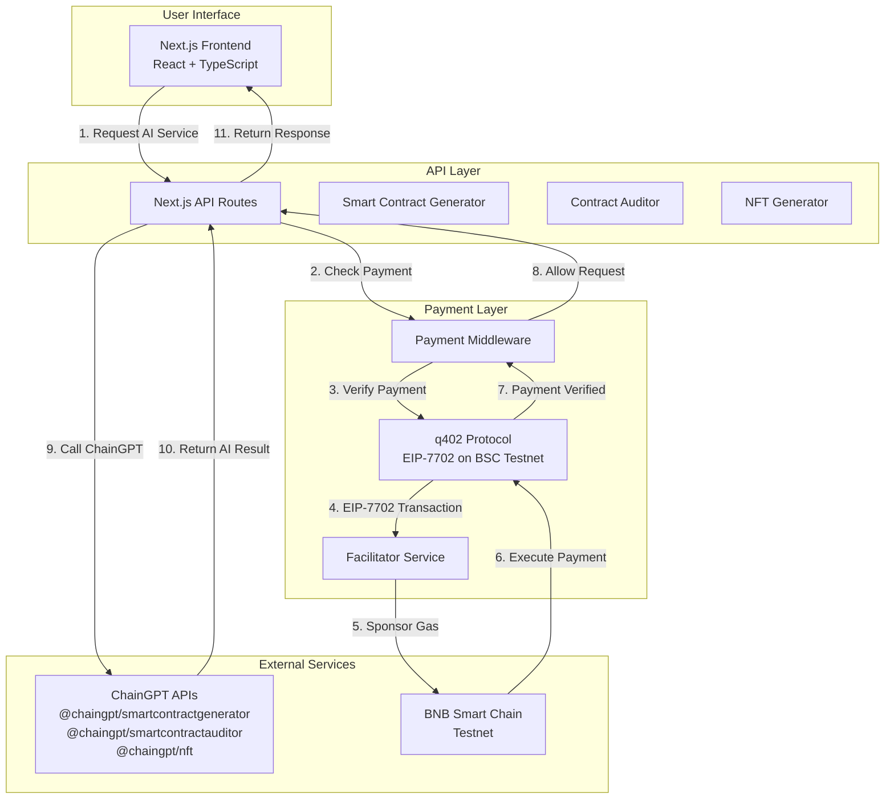

# Q402-Copilot: ChainGPT API Wrapper with Pay-Per-Call

> 🚀 **Web3 Copilot for BNB Chain**: A complete wrapper implementation that integrates ChainGPT AI APIs with the q402 payment protocol, enabling gasless, pay-per-call access to AI-powered smart contract tools.

**Built for the Quack × ChainGPT Super Web3 Agent Hackathon**

## What is Q402-Copilot?

Q402-Copilot is a **wrapper application** that combines:
- **q402 Protocol**: An EIP-7702 delegated payment protocol (x402 implementation on BSC testnet)
- **ChainGPT APIs**: AI-powered smart contract generation, auditing, and NFT creation
- **Pay-Per-Call Model**: Users pay for each API call using gasless BSC payments

This project enables users to access ChainGPT's powerful AI tools (smart contract generation, auditing, NFT generation) through a seamless Web3 payment flow where **users never pay gas fees** - the facilitator sponsors all transactions.

## Architecture Overview



## Core Features

### 🤖 AI-Powered Tools
- **Smart Contract Generator**: Generate Solidity contracts from natural language descriptions
- **Contract Auditor**: Security audit reports with vulnerability detection
- **NFT Generator**: Create NFT metadata and images using AI

### 💰 Pay-Per-Call Model
- **Gasless Payments**: Users sign transactions, facilitator pays gas
- **BSC Testnet**: All payments processed on BNB Smart Chain testnet
- **ERC-20 Tokens**: Pay with any ERC-20 token (USDT, BUSD, etc.)
- **No Approvals Needed**: EIP-7702 eliminates the need for token approvals

### 🔒 Security & Safety
- **Basic Safety Checks**: Automatic detection of common vulnerabilities
- **Access Control**: Payment verification before API access
- **Nonce Protection**: Prevents replay attacks
- **Deadline Enforcement**: Time-limited payment validity

## How It Works

### Payment Flow

1. **User Requests Service**: User wants to generate a smart contract
2. **Server Responds with 402**: Server returns payment details (amount, token, recipient)
3. **User Signs Payment**: User creates EIP-7702 authorization + EIP-712 witness signature
4. **Payment Header Sent**: User includes `X-PAYMENT` header in request
5. **Middleware Verifies**: Server verifies payment signature and authorization
6. **Facilitator Settles**: Facilitator submits EIP-7702 transaction (sponsors gas)
7. **Payment Executed**: Tokens transferred from user to server on BSC
8. **API Access Granted**: ChainGPT API called and result returned to user

### Example: Smart Contract Generation

```typescript
// 1. User requests contract generation
POST /api/smart-contracts/generate
{
  "question": "Create an ERC20 token named Q402"
}

// 2. Server responds with 402 Payment Required
{
  "scheme": "evm/eip7702-delegated-payment",
  "networkId": "bsc-testnet",
  "token": "0x...",
  "amount": "1000000", // 1 USDT
  "to": "0xServerAddress",
  "implementationContract": "0x...",
  "witness": { /* EIP-712 typed data */ },
  "authorization": { /* EIP-7702 auth tuple */ }
}

// 3. User signs and includes X-PAYMENT header
POST /api/smart-contracts/generate
Headers: {
  "X-PAYMENT": "base64EncodedPaymentPayload"
}
Body: {
  "question": "Create an ERC20 token named Q402"
}

// 4. Server verifies payment, calls ChainGPT, returns contract
{
  "success": true,
  "contract": "// SPDX-License-Identifier: MIT\npragma solidity..."
}
```

## Features Breakdown

### 1. Smart Contract Generator

**Endpoint**: `/api/smart-contracts/generate`

- **Input**: Natural language description of desired contract
- **Output**: Complete Solidity contract code
- **Special Feature**: Pre-made ERC20 token contract for "Q402" requests
- **Payment**: Pay-per-generation model

**Example**:
- Input: "Create an ERC20 token named Q402"
- Output: Complete ERC20 contract with minting, burning, and ownership

### 2. Contract Auditor

**Endpoint**: `/api/contract-auditor/audit`

- **Input**: Solidity contract code
- **Output**: Security audit report with vulnerabilities
- **Features**:
  - Basic safety checks (automatic)
  - AI-powered deep analysis (via ChainGPT)
  - Vulnerability categorization (Critical, Warning, Info)
- **Payment**: Pay-per-audit model

**Safety Checks Include**:
- Reentrancy protection
- Unchecked arithmetic
- Dangerous delegatecall usage
- Missing access controls
- Zero address checks
- And more...

### 3. NFT Generator

**Endpoint**: `/api/nft-generate`

- **Input**: NFT description or prompt
- **Output**: NFT metadata and image
- **Payment**: Pay-per-generation model

## q402 Protocol Integration

This project uses **q402**, which is an implementation of the **x402 protocol** on BSC testnet using EIP-7702 delegated execution.

### Key Differences from Traditional x402

| Feature | Traditional x402 | q402 (This Project) |
|---------|-----------------|---------------------|
| Token Support | Requires ERC-3009 | Works with any ERC-20 |
| Approvals | Requires pre-approval | No approvals needed |
| Gas Payment | User pays gas | Facilitator sponsors gas |
| Network | Ethereum | BSC Testnet |
| Execution | ERC-3009 transfer | EIP-7702 delegated execution |

### EIP-7702 Benefits

- **No Token Upgrades**: Works with existing ERC-20 tokens
- **Gasless for Users**: Facilitator pays all gas fees
- **Single Signature**: User signs once, payment executes automatically
- **No Approvals**: Direct transfers without allowance mechanism

## Getting Started

### Prerequisites

- Node.js 18+ and pnpm
- BSC Testnet wallet with test tokens
- ChainGPT API key (optional - fallback responses available)

### Installation

```bash
# Install dependencies
cd frontend
npm install

# Or use pnpm (recommended)
pnpm install
```

### Configuration

Create a `.env.local` file in the `frontend/` directory:

```env
# ChainGPT API (optional - will use fallback if not set)
CHAINGPT_API_KEY=your_chaingpt_api_key

# q402 Configuration
Q402_NETWORK=bsc-testnet
Q402_IMPLEMENTATION_CONTRACT=0x...
Q402_RECIPIENT_ADDRESS=0x...
Q402_TOKEN_ADDRESS=0x...  # USDT or BUSD on testnet
```

### Running the Application

```bash
# Development mode
cd frontend
npm run dev

# Production build
npm run build
npm start
```

The application will be available at `http://localhost:3000`

## Usage Examples

### 1. Generate Smart Contract

```typescript
// Frontend code
const response = await fetch('/api/smart-contracts/generate', {
  method: 'POST',
  headers: {
    'Content-Type': 'application/json',
    'X-PAYMENT': paymentHeader, // q402 payment header
  },
  body: JSON.stringify({
    question: 'Create an ERC20 token named Q402',
  }),
});

const { contract } = await response.json();
console.log(contract); // Complete Solidity code
```

### 2. Audit Contract

```typescript
const response = await fetch('/api/contract-auditor/audit', {
  method: 'POST',
  headers: {
    'Content-Type': 'application/json',
    'X-PAYMENT': paymentHeader,
  },
  body: JSON.stringify({
    question: contractCode, // Solidity contract code
  }),
});

const { audit } = await response.json();
console.log(audit); // Security audit report
```

## Payment Details

### Supported Tokens
- USDT (BSC Testnet)
- BUSD (BSC Testnet)
- Any ERC-20 token on BSC Testnet

### Pricing Model
- **Pay-per-call**: Each API request requires payment
- **Amount**: Configurable per endpoint
- **Gas**: Sponsored by facilitator (user pays $0 gas)

### Payment Flow
1. User receives 402 Payment Required response
2. User signs EIP-7702 authorization + EIP-712 witness
3. User includes `X-PAYMENT` header in subsequent request
4. Server verifies and facilitator settles payment
5. API access granted

## API Endpoints

### Smart Contract Generation
- `POST /api/smart-contracts/generate` - Generate contract (full response)
- `POST /api/smart-contracts/stream` - Generate contract (streaming)

### Contract Auditing
- `POST /api/contract-auditor/audit` - Audit contract (full report)
- `POST /api/contract-auditor/stream` - Audit contract (streaming)

### NFT Generation
- `POST /api/nft-generate` - Generate NFT metadata and image

## Frontend Pages

- `/` - Landing page
- `/smart-contracts` - Smart contract generator UI
- `/contract-auditor` - Contract auditor UI
- `/nft-generator` - NFT generator UI
- `/chat` - Chat interface (coming soon)
- `/402` - q402 payment demo

## Technology Stack

- **Frontend**: Next.js 16, React 19, TypeScript, Tailwind CSS
- **Backend**: Next.js API Routes
- **Blockchain**: viem, wagmi, RainbowKit
- **Payment Protocol**: q402 (EIP-7702 on BSC Testnet)
- **AI Services**: ChainGPT SDKs
- **Styling**: Tailwind CSS with custom frame borders

## Security Features

### Payment Security
- ✅ EIP-712 signature verification
- ✅ EIP-7702 authorization validation
- ✅ Nonce-based replay protection
- ✅ Deadline enforcement
- ✅ Implementation contract whitelist

### Code Security
- ✅ Basic vulnerability scanning
- ✅ AI-powered security analysis
- ✅ Access control verification
- ✅ Input validation

## Development Status

### ✅ Completed
- Smart contract generator with ERC20 template
- Contract auditor with basic safety checks
- NFT generator integration
- q402 payment middleware
- Frontend UI components
- Payment flow implementation

### 🚧 In Progress
- Full ChainGPT API integration
- Enhanced error handling
- Payment history tracking
- User dashboard

### 📋 Planned
- Batch payment support
- Multi-token support
- Payment analytics
- Admin dashboard

## Contributing

This project was built for the **Quack × ChainGPT Super Web3 Agent Hackathon**. Contributions are welcome!

See [CONTRIBUTING.md](./CONTRIBUTING.md) for guidelines.

## License

Apache-2.0

## Acknowledgments

- **q402 Protocol**: EIP-7702 implementation of x402 on BSC
- **ChainGPT**: AI-powered blockchain tools
- **x402 Protocol**: Original payment protocol by Coinbase
- **Quack AI**: Hackathon organizer and ecosystem partner

## Related Projects

- [q402 Protocol](../README.md) - Core payment protocol implementation
- [x402 Protocol](https://github.com/coinbase/x402) - Original Coinbase implementation
- [ChainGPT](https://chaingpt.org/) - AI-powered blockchain tools

---

**Built with ❤️ for the Quack × ChainGPT Super Web3 Agent Hackathon**
